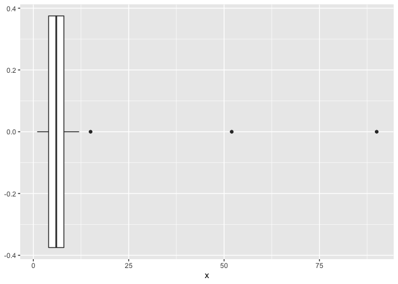
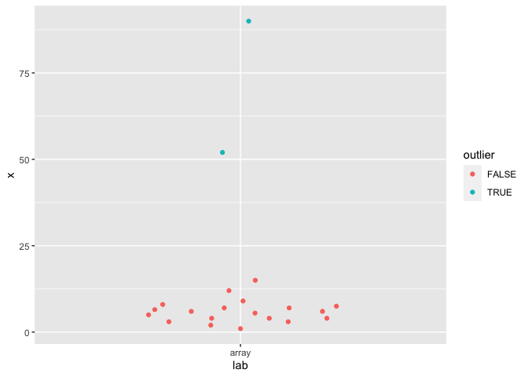
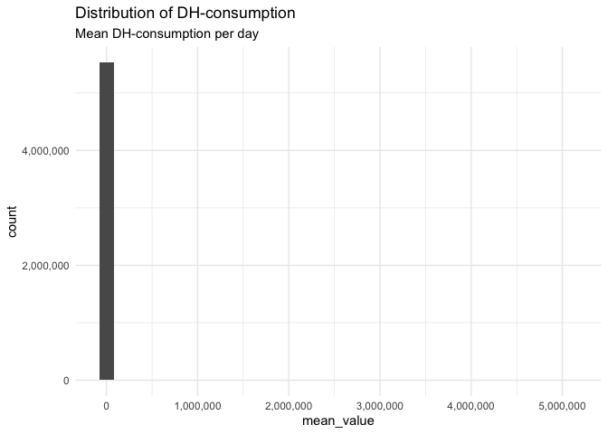
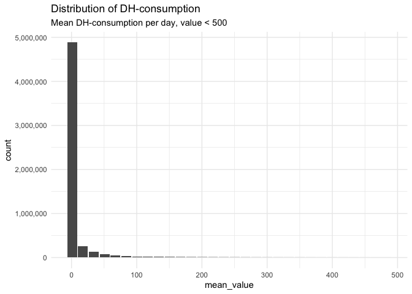
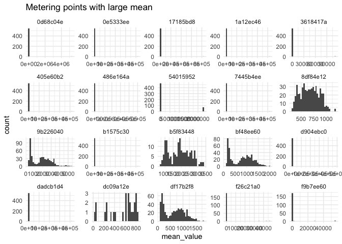
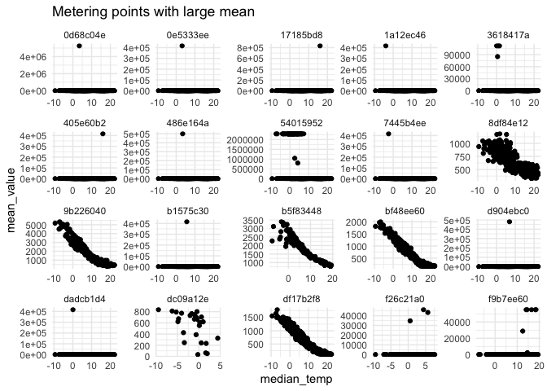
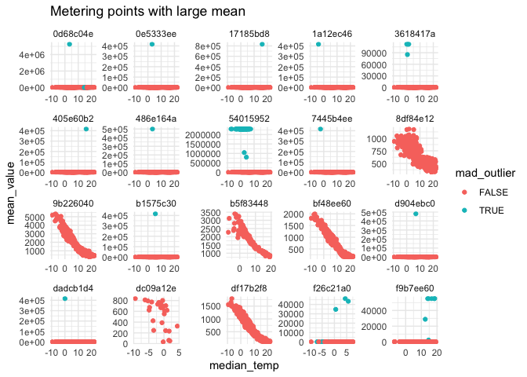
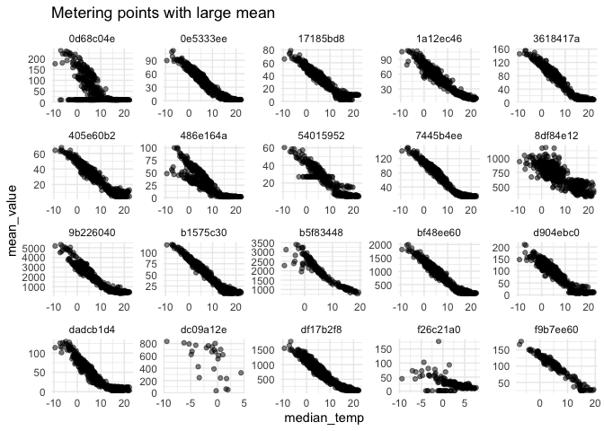

## Extreme values in District Heating

Extreme values are common in a district heating network. The cause of an
extreme value can be everything between leaking pipes to a person
opening all doors in a house to ventilate. Extreme values are often easy
to identify by just looking a visualization for a metering station
within a district heating network. However, it is impossible (or at
least very expensive) to have somebody look at visualizations for a
whole DH-network.

This is why we have software such as K2, which is an application
developed by the organization Smart Energi to detect outliers. Extreme
values are most likely detected in a system such as K2. Nevertheless, if
an extreme value may effect the algorithm in K2, since it uses linear
regression which is not immune to extreme outliers. Thus, there is a
strong case for employing some rudimentary extreme value detection
technique on data before running it in an application such as K2.

Nevertheless, such a method is not a replacement of the K2 algorithm,
just a filter before it.

## Outlier detection

In statistics this field is called `outlier detection`. Most of us
remember `*the boxplot*`, it uses one of the most popular methods to
identify outliers: the Inter Quantile Range (`IQR`). First it calculates
the `IQR`, that is, the difference between the first and third quartile,
then it multiplies the `IQR` with some constant and compares it with
respective quantile. If a value is larger than the upper threshold or
smaller than the lower, it is considered an outlier.

, \ upper = Q3 + k * IQR(X)")

The outliers in a boxplot are represented by the dots:

``` r
library(tidyverse)
x <- c(1, 2, 3, 3, 4, 4, 4, 5, 5.5, 6, 6, 6.5, 7, 7, 7.5, 8, 9, 12, 15, 52, 90)
df <- tibble(x = x)

ggplot(df, aes(x)) +
  geom_boxplot()
```

<!-- -->

However, the IQR-method, although popular, is not considered robust
since it only based on the values between the first and third quartile,
thus ignoring every other value. Instead statistical researchers (Leys,
2013 and Yang, 2019) have argued that we use more robust techniques
based on another measurement of dispersion called the Median Absolute
Deviation (MAD).

One method, called the Double MAD (Rosenmai, 2013), have proven to be an
efficient technique to find outliers, particularly when data is highly
skewed, which District Heating data often is. It is actually quite
simple. First we calculate the median for some data and then we compute
two MAD, one for the data smaller than the median and one for the
larger. The lower threshold is

and the upper threshold then is the
.
A more in depth explanation of the Double MAD can be found
[here](https://aakinshin.net/posts/harrell-davis-double-mad-outlier-detector/#adopting-to-nonsymmetric-distributions-with-double-mad).

In order to make this method more robust, researcher Andrey Akinshin
[suggest]((https://aakinshin.net/posts/harrell-davis-double-mad-outlier-detector/#adopting-to-nonsymmetric-distributions-with-double-mad))
that we use the Harrell-Davis quantile estimator to estimate the median.

Computationally, we can define a function that returns TRUE or FALSE for
when an outlier is defined.

``` r
double_mad <- function(x, k) {
  hdmedian <- function(u) as.numeric(Hmisc::hdquantile(u, 0.5))
  
  x <- x[!is.na(x)]
  m <- hdmedian(x)
  deviations <- abs(x - m)
  lowerMAD <- 1.4826 * hdmedian(deviations[x <= m])
  upperMAD <- 1.4826 * hdmedian(deviations[x >= m])
  
  if_else(x >= m - k * lowerMAD & x <= m + k * upperMAD, "FALSE", "TRUE")
  
}

double_mad(x , k = 3)
```

    ##  [1] "FALSE" "FALSE" "FALSE" "FALSE" "FALSE" "FALSE" "FALSE" "FALSE" "FALSE"
    ## [10] "FALSE" "FALSE" "FALSE" "FALSE" "FALSE" "FALSE" "FALSE" "FALSE" "FALSE"
    ## [19] "FALSE" "TRUE"  "TRUE"

If we visualize the result we see that only the two largest values are
defined as outliers, which is what we would want from this dataset.

``` r
library(ggbeeswarm)
df <- tibble(x = x, 
             lab = "array",
             outlier = double_mad(x, k = 3))

ggplot(df, aes(x = lab, y = x, color = outlier)) +
   geom_quasirandom()
```

<!-- -->

## Using the Double MAD on District heating data

In the BRAVA Datalake we have data that originally comes from
Öresundskraft, but it is provided to BRAVA by Halmstad University who
have used the data in the development of their outlier detection
algorithm that you can read more about in their notebook [Conformal
anomaly sequence detection via the reference-group based approach: a
study on district heating
substations](https://kyso.io/smartenergi/conformal-anomaly-sequence-detection-via-the-reference-group-based-approach-a-study-on-district-heating-substations?team=smartenergi).

The data consist of hourly district heating consumption for around 12
000 metering points. In total there is more than 100 million rows.

For this Notebook we’ll limit ourselves to *daily* `energy` data and not
`flow`. This is the same data that is used in K2. Furthermore, daily
data drastically reduces the computation needed to perform outlier
detection.

To connect to the datalake is pretty straight forward and we can take a
look at the first six rows in the data:

``` r
con <- dbConnect(odbc::odbc(), Driver = "Snowflake", Server = "brava-server.snowflakecomputing.com", 
    uid = "username", Database = "BRAVA_DATALAKE", pwd = keyring::key_get("brava"))
```

``` r
tbl(con, in_schema("PUBLIC", "ORKAFT_METER_READINGS_TBL")) %>% 
  filter(PROPERTY == "energy") %>% 
  head()
```

    ## # Source:   lazy query [?? x 5]
    ## # Database: Snowflake 4.43.1[filipw@Snowflake/SMARTENERGI_DATALAKE_SANDBOX]
    ##   METERING_POINT_ID               date       PROPERTY UNIT_OF_MEASURE mean_value
    ##   <chr>                           <date>     <chr>    <chr>                <dbl>
    ## 1 676da7d4-70ac-11ea-ae00-062fc1… 2016-05-01 energy   MWh                   6.14
    ## 2 676da7d4-70ac-11ea-ae00-062fc1… 2016-07-09 energy   MWh                   1   
    ## 3 aa6d500a-70ae-11ea-ae00-062fc1… 2016-09-19 energy   MWh                   1.07
    ## 4 aa6d500a-70ae-11ea-ae00-062fc1… 2016-10-07 energy   MWh                   1.5 
    ## 5 9ecf5b20-70af-11ea-ae00-062fc1… 2016-03-03 energy   MWh                  16.3 
    ## 6 9ecf5b20-70af-11ea-ae00-062fc1… 2016-03-17 energy   MWh                  14.5

The weather-data, which is the same for all metering stations, is stored
in a separate table that we can join to the data.

``` r
okraft_tbl <- tbl(con, in_schema("PUBLIC", "ORKAFT_METER_READINGS_TBL")) %>% 
  filter(PROPERTY == "energy") %>% 
  left_join(
    tbl(con, in_schema("PUBLIC", "oresundskraft_weather")),
    by = c("date")
  )
```

## Exploring data

We can use the package `dbplot` to visualize large datasets within a
database. For instance, we are interested in the distribution of
district heating consumption.

``` r
library(dbplot)
library(scales)

okraft_tbl %>% 
  dbplot_histogram(x = mean_value) +
  theme_minimal() +
  labs(
    title = "Distribution of DH-consumption",
    subtitle = "Mean DH-consumption per day"
  ) +
  scale_y_continuous(labels = comma) +
  scale_x_continuous(labels = comma)
```

<!-- -->

It is obvious that we have extreme values, even if we filter out values
larger than 500.

``` r
okraft_tbl %>% 
  filter(mean_value < 500) %>% 
  dbplot_histogram(x = mean_value) +
  theme_minimal() +
  labs(
    title = "Distribution of DH-consumption",
    subtitle = "Mean DH-consumption per day, value < 500"
  ) +
  scale_y_continuous(labels = comma) +
  scale_x_continuous(labels = comma)
```

<!-- -->

It is not straight forward how we would choose an arbitrary threshold to
filter on. Therefore, a more sophisticated method is needed.

To investigate the Double MAD we’ll start by applying it on a couple of
metering points we suspect have outliers, since they have a high mean.

<!-- -->

I we visualize consumption against temperature, the picture gets
clearer.

``` r
okraft_top20 %>% 
  ggplot(aes(x = median_temp, y = mean_value)) +
  geom_point() +
  facet_wrap(~metering_point_id, scales = "free") +
  theme_minimal() +
  labs(
    title = "Metering points with large mean"
  )
```

<!-- -->

If we apply the double mad to each metering point with `k = 3` see that
it captures the extreme values.

``` r
okraft_top20 %>% 
  group_by(metering_point_id) %>% 
  mutate(mad_outlier = double_mad(mean_value, k = 3)) %>% 
  ggplot(aes(x = median_temp, y = mean_value, color = mad_outlier)) +
  geom_point() +
  facet_wrap(~metering_point_id, scales = "free") +
  theme_minimal() +
  labs(
    title = "Metering points with large mean"
  )
```

<!-- -->
However, there are also some values classified as outliers that we’re
not sure of. A remedy to this is to select a larger scaling factor `k`.

``` r
okraft_top20 %>% 
  group_by(metering_point_id) %>% 
  mutate(mad_outlier = double_mad(mean_value, k = 15)) %>% 
  ggplot(aes(x = median_temp, y = mean_value, color = mad_outlier)) +
  geom_point() +
  facet_wrap(~metering_point_id, scales = "free") +
  theme_minimal() +
  labs(
    title = "Metering points with large mean"
  )
```

<!-- -->

If we filter away the outliers we can still observe some outliers, but
these aren’t that extreme and should thus be captured by the algorithm
in K2.

``` r
okraft_top20 %>% 
  group_by(metering_point_id) %>% 
  mutate(mad_outlier = double_mad(mean_value, k = 15)) %>% 
  filter((mad_outlier != TRUE)) %>% 
  ggplot(aes(x = median_temp, y = mean_value)) +
  geom_point(alpha = 0.5) +
  facet_wrap(~metering_point_id, scales = "free") +
  theme_minimal() +
  labs(
    title = "Metering points with large mean"
  )
```

<!-- -->

## A scalable implementation of double MAD

Now, we’d like to use the double mad function for each metering point in
a District Heating network. There are multiple ways we can do this.
However, since we are using a robust technique to compute the median we
need a programming language like R. It might be possible to implement
this within a database framework, at least if you use Snowflake that
supports median computations. But if it doesn’t (like Microsoft SQL) it
will be hard.

Since we are computing the double MAD for each metering point the most
straight forward way to do this would be to parallelize the computation
and then append the result to a table. Below is a skeleton for code that
could be parallelized. The unparallized code takes a couple of hours to
run.

``` r
okraft_tbl <- tbl(con, in_schema("PUBLIC", "ORKAFT_METER_READINGS_TBL")) %>% 
  filter(PROPERTY == "energy") %>% 
  left_join(
    tbl(con, in_schema("PUBLIC", "oresundskraft_weather")),
    by = c("date")
  )

dbCreateTable(con, Id(database = "SMARTENERGI_DATALAKE_SANDBOX", schema = "PUBLIC", table = "OKRAFT_MAD"), data)

dmad_tbl <- function(metering_point_id){
  data <- okraft_tbl %>% 
    filter(METERING_POINT_ID == metering_point_id) %>% 
    collect()
    
  data <- data %>% 
    mutate(mad_outlier = double_mad(mean_value, k = 3))

  table_id <- Id(database = "SMARTENERGI_DATALAKE_SANDBOX", schema = "PUBLIC", table = "OKRAFT_MAD")

  dbWriteTable(con, table_id, data, append = TRUE)
}

metering_points <- okraft_tbl %>% 
  distinct(METERING_POINT_ID) %>% 
  pull(METERING_POINT_ID) %>% 
  set_names()

metering_p_sample <- top20_consumption %>% 
  pull(METERING_POINT_ID) %>% 
  set_names()

map(metering_points, dmad_tbl)
```
